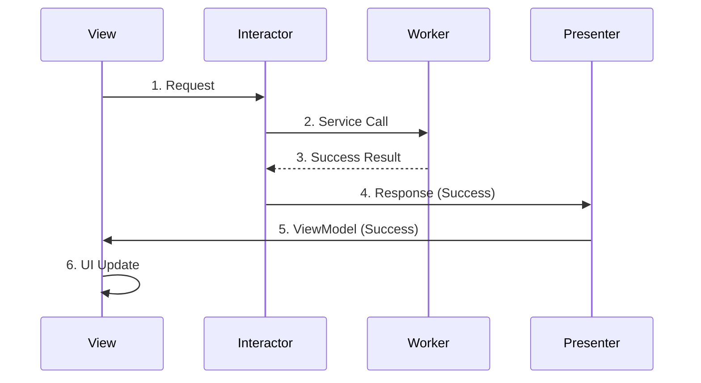
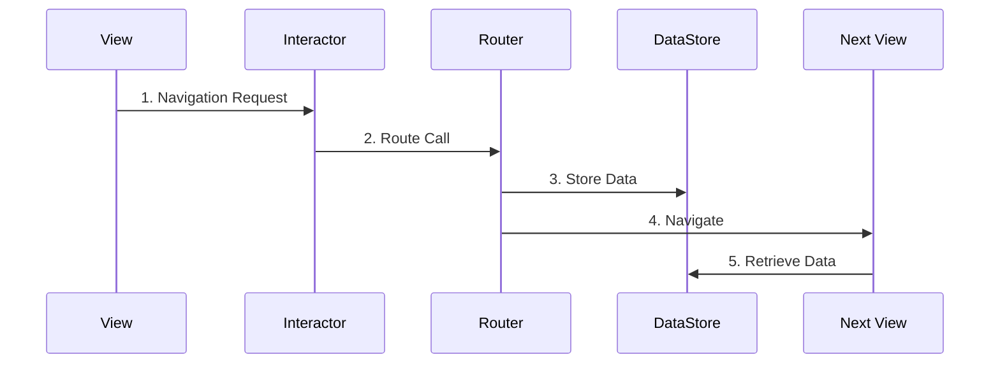

# 📐 Kingtherum iOS 아키텍처 문서

## 📋 목차
1. [개요](#개요)
2. [Clean Swift (VIP) 아키텍처](#clean-swift-vip-아키텍처)
3. [프로젝트 구조](#프로젝트-구조)
4. [VIP 컴포넌트 상세](#vip-컴포넌트-상세)
5. [데이터 흐름](#데이터-흐름)
6. [모듈 구조](#모듈-구조)
7. [테스팅 전략](#테스팅-전략)
8. [코드 생성 도구](#코드-생성-도구)
9. [Best Practices](#best-practices)
10. [마이그레이션 가이드](#마이그레이션-가이드)

## 🎯 개요

Kingtherum iOS 앱은 **Clean Swift (VIP) 아키텍처**를 기반으로 설계된 암호화폐 지갑 애플리케이션입니다. 

### 🏗️ 아키텍처 목표
- **관심사 분리**: 각 컴포넌트가 단일 책임을 가짐
- **테스트 용이성**: 높은 테스트 커버리지와 Mock 가능한 구조
- **확장성**: 새로운 기능 추가 시 기존 코드에 최소한의 영향
- **유지보수성**: 명확한 구조와 일관성 있는 패턴
- **팀 개발 효율성**: 예측 가능한 코드 구조

### 🛠️ 기술 스택
- **언어**: Swift 6.0+
- **UI**: SwiftUI (Code-based, No Storyboard)
- **비동기**: Swift Concurrency (async/await, Actor)
- **의존성 주입**: Factory Pattern
- **빌드 시스템**: Tuist 4.48.1
- **테스팅**: XCode 16+ Testing Framework

## 🏛️ Clean Swift (VIP) 아키텍처

### 📊 VIP 패턴 구조

```
┌─────────────┐    Request     ┌──────────────┐    Response    ┌──────────────┐
│             │───────────────▶│              │───────────────▶│              │
│    View     │                │  Interactor  │                │  Presenter   │
│ (SwiftUI)   │◀───────────────│ (Business    │◀───────────────│ (Formatting) │
│             │   ViewModel    │  Logic)      │                │              │
└─────────────┘                └──────────────┘                └──────────────┘
       │                               │                               ▲
       │                               ▼                               │
       │                       ┌──────────────┐                       │
       │                       │              │                       │
       └──────────────────────▶│    Worker    │───────────────────────┘
                  Routing       │ (External    │    Data/Errors
                               │  Services)   │
                               └──────────────┘
                                       │
                                       ▼
                               ┌──────────────┐
                               │    Router    │
                               │ (Navigation) │
                               └──────────────┘
```

### 🔄 데이터 흐름 (단방향)

```swift
// 1. View → Interactor (Request)
func createWallet() {
    let request = Authentication.CreateWallet.Request(walletName: walletName)
    interactor?.createWallet(request: request)
}

// 2. Interactor → Worker (External Service)
let walletResult = await worker.createWallet(name: request.walletName)

// 3. Interactor → Presenter (Response)
let response = Authentication.CreateWallet.Response(
    success: true,
    wallet: wallet,
    error: nil
)
presenter?.presentWalletCreationResult(response: response)

// 4. Presenter → View (ViewModel)
let viewModel = Authentication.CreateWallet.ViewModel(
    success: response.success,
    walletAddress: response.wallet?.address,
    displayAddress: formatAddress(response.wallet?.address),
    errorMessage: formatError(response.error)
)
viewController?.displayWalletCreationResult(viewModel: viewModel)
```

## 🏗️ 프로젝트 구조

### 📁 Tuist 모듈 구조

```
Kingtherum/
├── Projects/
│   ├── App/                    # 메인 앱 모듈
│   │   ├── Sources/
│   │   │   ├── Scenes/         # VIP Scene 구현
│   │   │   │   ├── Authentication/
│   │   │   │   ├── History/
│   │   │   │   ├── Send/
│   │   │   │   ├── Receive/
│   │   │   │   └── Settings/
│   │   │   └── Application/    # App Delegate, Scene Delegate
│   │   └── Tests/              # Scene별 테스트
│   │       └── Scenes/
│   ├── Entity/                 # 도메인 모델 및 Scene Models
│   │   └── Sources/
│   │       ├── Models/         # 데이터 모델
│   │       └── Scenes/         # VIP Scene Models
│   ├── Core/                   # 공통 유틸리티
│   │   └── Sources/
│   │       ├── Router/         # 네비게이션 관리
│   │       ├── Extensions/     # Swift 확장
│   │       └── Utils/          # 유틸리티
│   └── WalletKit/              # 지갑 관련 로직
│       └── Sources/
│           ├── Services/       # 외부 서비스
│           └── Repositories/   # 데이터 저장소
└── Scripts/
    └── VIPGenerator/           # 코드 생성 도구
```

### 🎭 Scene 구조 (표준 패턴)

```
Authentication/
├── AuthenticationModels.swift           # Request, Response, ViewModel 정의
├── AuthenticationInteractor.swift       # 비즈니스 로직
├── AuthenticationPresenter.swift        # 데이터 포맷팅
├── AuthenticationWorker.swift          # 외부 서비스 통신
├── AuthenticationRouter.swift          # 화면 전환
└── AuthenticationView.swift            # SwiftUI 뷰
```

## 🔧 VIP 컴포넌트 상세

### 1️⃣ View (SwiftUI)

**역할**: UI 표시 및 사용자 입력 처리

```swift
struct AuthenticationView: View {
    @StateObject private var viewModel = AuthenticationViewModel()
    private var interactor: AuthenticationBusinessLogic?
    private var router: AuthenticationRoutingLogic?
    
    var body: some View {
        VStack {
            // UI 컴포넌트들
        }
        .onTapGesture {
            // 사용자 입력을 Interactor로 전달
            let request = Authentication.CreateWallet.Request(walletName: walletName)
            interactor?.createWallet(request: request)
        }
    }
}

// DisplayLogic 프로토콜 구현
extension AuthenticationView: AuthenticationDisplayLogic {
    func displayWalletCreationResult(viewModel: Authentication.CreateWallet.ViewModel) {
        // UI 업데이트
    }
}
```

**핵심 원칙**:
- UI 로직만 포함, 비즈니스 로직 금지
- 사용자 입력을 Request로 변환하여 Interactor에 전달
- ViewModel을 받아 UI 업데이트

### 2️⃣ Interactor (Business Logic)

**역할**: 비즈니스 로직 처리 및 UseCase 구현

```swift
class AuthenticationInteractor {
    private let presenter: AuthenticationPresentationLogic
    private let worker: AuthenticationWorkerProtocol
    
    init(presenter: AuthenticationPresentationLogic, 
         worker: AuthenticationWorkerProtocol) {
        self.presenter = presenter
        self.worker = worker
    }
}

extension AuthenticationInteractor: AuthenticationBusinessLogic {
    func createWallet(request: Authentication.CreateWallet.Request) async {
        // 1. 입력 검증
        guard !request.walletName.isEmpty else {
            let error = AuthenticationError.invalidInput("지갑 이름을 입력해주세요")
            presenter.presentError(response: Authentication.Error.Response(error: error))
            return
        }
        
        // 2. Worker를 통한 외부 서비스 호출
        let result = await worker.createWallet(name: request.walletName)
        
        // 3. 결과를 Response로 변환하여 Presenter에 전달
        switch result {
        case .success(let wallet):
            let response = Authentication.CreateWallet.Response(
                success: true,
                wallet: wallet,
                error: nil
            )
            presenter.presentWalletCreationResult(response: response)
            
        case .failure(let error):
            let response = Authentication.CreateWallet.Response(
                success: false,
                wallet: nil,
                error: error
            )
            presenter.presentWalletCreationResult(response: response)
        }
    }
}
```

**핵심 원칙**:
- 순수한 비즈니스 로직만 포함
- UI나 데이터베이스에 직접 접근 금지
- Worker를 통해 외부 서비스와 통신
- 모든 결과를 Presenter에 전달

### 3️⃣ Presenter (Data Formatting)

**역할**: Response를 ViewModel로 변환

```swift
class AuthenticationPresenter {
    weak var viewController: AuthenticationDisplayLogic?
    
    init(viewController: AuthenticationDisplayLogic?) {
        self.viewController = viewController
    }
}

extension AuthenticationPresenter: AuthenticationPresentationLogic {
    func presentWalletCreationResult(response: Authentication.CreateWallet.Response) {
        let viewModel: Authentication.CreateWallet.ViewModel
        
        if response.success, let wallet = response.wallet {
            // 성공 케이스: 데이터 포맷팅
            viewModel = Authentication.CreateWallet.ViewModel(
                success: true,
                walletAddress: wallet.address,
                displayAddress: formatWalletAddress(wallet.address),
                walletName: wallet.name,
                mnemonicWords: wallet.mnemonic.components(separatedBy: " "),
                showMnemonic: true,
                errorMessage: nil,
                nextButtonTitle: "계속",
                nextButtonEnabled: true
            )
        } else {
            // 실패 케이스: 에러 메시지 변환
            let errorMessage = formatError(response.error)
            viewModel = Authentication.CreateWallet.ViewModel(
                success: false,
                walletAddress: nil,
                displayAddress: nil,
                walletName: nil,
                mnemonicWords: [],
                showMnemonic: false,
                errorMessage: errorMessage,
                nextButtonTitle: "다시 시도",
                nextButtonEnabled: true
            )
        }
        
        viewController?.displayWalletCreationResult(viewModel: viewModel)
    }
    
    private func formatWalletAddress(_ address: String) -> String {
        guard address.count > 10 else { return address }
        let prefix = String(address.prefix(6))
        let suffix = String(address.suffix(4))
        return "\(prefix)...\(suffix)"
    }
    
    private func formatError(_ error: Error?) -> String {
        guard let error = error else { return "" }
        
        switch error {
        case WalletError.mnemonicGenerationFailed:
            return "지갑 생성 중 오류가 발생했습니다. 니모닉 생성에 실패했습니다."
        case WalletError.keychainError:
            return "지갑을 안전하게 저장할 수 없습니다. 기기 설정을 확인해주세요."
        default:
            return "알 수 없는 오류가 발생했습니다. 다시 시도해주세요."
        }
    }
}
```

**핵심 원칙**:
- 데이터 포맷팅과 변환만 담당
- 비즈니스 로직 포함 금지
- 사용자 친화적인 메시지로 변환
- 국제화 대응 가능한 구조

### 4️⃣ Worker (External Services)

**역할**: 외부 서비스와의 통신

```swift
protocol AuthenticationWorkerProtocol {
    func createWallet(name: String) async -> Result<Wallet, WalletError>
    func importWallet(mnemonic: String, name: String) async -> Result<Wallet, WalletError>
    func setupPin(_ pin: String) async -> Result<Void, AuthenticationError>
    func validatePin(_ pin: String) async -> Result<Bool, AuthenticationError>
}

class AuthenticationWorker: AuthenticationWorkerProtocol {
    private let walletService: WalletServiceProtocol
    private let keychainService: KeychainServiceProtocol
    private let biometricService: BiometricServiceProtocol
    
    init(walletService: WalletServiceProtocol = Container.walletService,
         keychainService: KeychainServiceProtocol = Container.keychainService,
         biometricService: BiometricServiceProtocol = Container.biometricService) {
        self.walletService = walletService
        self.keychainService = keychainService
        self.biometricService = biometricService
    }
    
    func createWallet(name: String) async -> Result<Wallet, WalletError> {
        // 1. 니모닉 생성
        guard let mnemonic = walletService.generateMnemonic() else {
            return .failure(.mnemonicGenerationFailed)
        }
        
        // 2. 지갑 생성
        do {
            let wallet = try walletService.createWallet(mnemonic: mnemonic, name: name)
            
            // 3. 키체인에 안전 저장
            try await keychainService.saveWallet(wallet)
            
            return .success(wallet)
        } catch {
            return .failure(.keychainError(error.localizedDescription))
        }
    }
    
    func setupPin(_ pin: String) async -> Result<Void, AuthenticationError> {
        do {
            try await keychainService.savePIN(pin)
            return .success(())
        } catch {
            return .failure(.keychainError(error.localizedDescription))
        }
    }
}
```

**핵심 원칙**:
- 외부 서비스와의 모든 통신 담당
- 네트워크, 데이터베이스, 키체인 등 접근
- 프로토콜을 통한 의존성 주입
- 에러 처리 및 변환

### 5️⃣ Router (Navigation)

**역할**: 화면 전환 및 데이터 전달

```swift
protocol AuthenticationRoutingLogic {
    func routeToMain()
    func routeToPinSetup()
    func routeToBiometricSetup()
    func routeToWalletImport()
}

protocol AuthenticationDataPassing {
    var dataStore: AuthenticationDataStore? { get }
}

class AuthenticationRouter: StandardRouter {
    weak var viewController: UIViewController?
    var dataStore: AuthenticationDataStore?
    
    override init() {
        super.init()
        self.loggerName = "AuthenticationRouter"
    }
}

extension AuthenticationRouter: AuthenticationRoutingLogic, AuthenticationDataPassing {
    func routeToMain() {
        guard let wallet = dataStore?.createdWallet else {
            logError("No wallet data available for main navigation")
            return
        }
        
        logNavigation("Navigating to main with wallet: \(wallet.address)")
        
        // 메인 화면으로 이동하면서 지갑 정보 전달
        let mainStoryboard = UIStoryboard(name: "Main", bundle: nil)
        if let mainVC = mainStoryboard.instantiateViewController(withIdentifier: "MainViewController") as? MainViewController {
            var mainDataStore = mainVC.router?.dataStore as? MainDataStore
            mainDataStore?.currentWallet = wallet
            
            navigationController?.setViewControllers([mainVC], animated: true)
        }
    }
    
    func routeToPinSetup() {
        logNavigation("Navigating to PIN setup")
        
        let pinSetupVC = PinSetupViewController()
        navigationController?.pushViewController(pinSetupVC, animated: true)
    }
}
```

**핵심 원칙**:
- 화면 전환 로직만 포함
- DataStore를 통한 화면간 데이터 전달
- 로깅을 통한 네비게이션 추적
- StandardRouter 상속으로 일관성 확보

### 6️⃣ Models (Data Structure)

**역할**: Request, Response, ViewModel 데이터 구조 정의

```swift
// Entity/Sources/Scenes/AuthenticationScene.swift
enum AuthenticationScene {
    
    // MARK: - Create Wallet Use Case
    enum CreateWallet {
        struct Request {
            let walletName: String
        }
        
        struct Response {
            let success: Bool
            let wallet: Wallet?
            let error: WalletError?
        }
        
        struct ViewModel {
            let success: Bool
            let walletAddress: String?
            let displayAddress: String?
            let walletName: String?
            let mnemonicWords: [String]
            let showMnemonic: Bool
            let errorMessage: String?
            let nextButtonTitle: String
            let nextButtonEnabled: Bool
            let showAlert: Bool
            let alertTitle: String?
        }
    }
    
    // MARK: - Import Wallet Use Case
    enum ImportWallet {
        struct Request {
            let mnemonic: String
            let walletName: String
        }
        
        struct Response {
            let success: Bool
            let wallet: Wallet?
            let error: WalletError?
        }
        
        struct ViewModel {
            let success: Bool
            let walletAddress: String?
            let displayAddress: String?
            let walletName: String?
            let successMessage: String?
            let errorMessage: String?
            let nextButtonTitle: String
            let nextButtonEnabled: Bool
            let showAlert: Bool
            let alertTitle: String?
        }
    }
    
    // MARK: - Error Handling
    enum Error {
        struct Response {
            let error: AuthenticationError
        }
        
        struct ViewModel {
            let title: String
            let message: String
            let errorType: String
            let primaryButtonTitle: String
            let secondaryButtonTitle: String?
            let showAlert: Bool
        }
    }
}
```

**핵심 원칙**:
- Entity 모듈에서 중앙 관리
- UseCase별 명확한 구조 정의
- Request: 최소한의 입력 데이터
- Response: 비즈니스 결과 데이터
- ViewModel: UI 표시용 포맷팅된 데이터

## 🔄 데이터 흐름

### 1️⃣ 정상 플로우 (Success Flow)



### 2️⃣ 에러 플로우 (Error Flow)


### 3️⃣ 라우팅 플로우 (Routing Flow)



## 🧪 테스팅 전략

### 📋 테스트 구조

```
Tests/
├── Scenes/
│   ├── Authentication/
│   │   ├── AuthenticationInteractorTests.swift
│   │   ├── AuthenticationPresenterTests.swift
│   │   ├── AuthenticationWorkerTests.swift
│   │   └── AuthenticationRouterTests.swift
│   ├── History/
│   └── Settings/
└── TestDoubles/
    ├── Spies/
    ├── Mocks/
    └── Stubs/
```

### 🎭 테스트 더블 패턴

#### Spy 클래스 예시

```swift
@MainActor
class PresentationLogicSpy: AuthenticationPresentationLogic {
    var presentWalletCreationResultCalled = false
    var presentWalletCreationResultResponse: AuthenticationScene.CreateWallet.Response?
    
    func presentWalletCreationResult(response: AuthenticationScene.CreateWallet.Response) {
        presentWalletCreationResultCalled = true
        presentWalletCreationResultResponse = response
    }
}
```

#### Mock 클래스 예시

```swift
class WorkerMock: AuthenticationWorkerProtocol {
    var createWalletCalled = false
    var createWalletResult: Result<Wallet, WalletError> = .success(Wallet.mock)
    
    func createWallet(name: String) async -> Result<Wallet, WalletError> {
        createWalletCalled = true
        return createWalletResult
    }
}
```

### 🧪 테스트 케이스 구조 (XCode 16+ Testing Framework)

```swift
import Testing
import Foundation
@testable import App

@Suite("AuthenticationInteractor 테스트")
struct AuthenticationInteractorTests {
    
    @Suite("지갑 생성")
    struct CreateWallet {
        
        @Test("성공 케이스")
        func testCreateWalletSuccess() async {
            // Given
            let presenterSpy = PresentationLogicSpy()
            let workerMock = WorkerMock()
            let sut = AuthenticationInteractor(
                presenter: presenterSpy,
                worker: workerMock
            )
            
            let request = AuthenticationScene.CreateWallet.Request(
                walletName: "테스트 지갑"
            )
            
            // When
            await sut.createWallet(request: request)
            
            // Then
            #expect(workerMock.createWalletCalled == true)
            #expect(await presenterSpy.presentWalletCreationResultCalled == true)
            
            let response = await presenterSpy.presentWalletCreationResultResponse
            #expect(response?.success == true)
        }
    }
}
```

### 📊 테스트 커버리지 목표

- **Interactor**: 95% 이상 (핵심 비즈니스 로직)
- **Presenter**: 90% 이상 (데이터 포맷팅)
- **Worker**: 85% 이상 (외부 서비스 통신)
- **Router**: 80% 이상 (네비게이션 로직)
- **전체 프로젝트**: 85% 이상

## 🔧 코드 생성 도구

### 📜 VIP Generator 스크립트

#### 기본 생성기

```bash
# 기본 VIP Scene 생성
./Scripts/VIPGenerator/VIPTemplate.swift generate ProfileSettings /path/to/destination

# 생성되는 파일들:
# - ProfileSettingsInteractor.swift
# - ProfileSettingsPresenter.swift  
# - ProfileSettingsWorker.swift
# - ProfileSettingsRouter.swift
# - ProfileSettingsView.swift
# - ProfileSettingsScene.swift (Entity 모듈)
```

#### 고급 생성기 (JSON 설정)

```bash
# 샘플 설정 파일 생성
./Scripts/VIPGenerator/ConfigurableVIPGenerator.swift config sample TransactionManagement config.json

# JSON 설정으로 Scene 생성
./Scripts/VIPGenerator/ConfigurableVIPGenerator.swift generate config.json /path/to/destination
```

#### JSON 설정 파일 예시

```json
{
  "sceneName": "UserProfile",
  "useCases": [
    {
      "name": "LoadProfile",
      "requestFields": [
        {
          "name": "userId",
          "type": "String",
          "comment": "사용자 ID"
        }
      ],
      "responseFields": [
        {
          "name": "user",
          "type": "User"
        },
        {
          "name": "error",
          "type": "Error",
          "isOptional": true
        }
      ],
      "viewModelFields": [
        {
          "name": "displayName",
          "type": "String"
        },
        {
          "name": "profileImage",
          "type": "String",
          "isOptional": true
        }
      ],
      "isAsyncOperation": true,
      "requiresNetwork": true
    }
  ],
  "options": {
    "generateTests": true,
    "useSwiftUI": true,
    "includeLogging": true
  }
}
```

### 🚀 생성기 사용법

```bash
# 1. 실행 권한 부여
chmod +x Scripts/VIPGenerator/*.swift

# 2. 기본 Scene 생성
cd Scripts/VIPGenerator
swift VIPTemplate.swift generate MyNewScene ~/Desktop/output

# 3. 설정 파일로 Scene 생성  
swift ConfigurableVIPGenerator.swift generate my-config.json ~/Desktop/output

# 4. 테스트 실행
./test-generation.sh
```

## 🎯 Best Practices

### 1️⃣ VIP 컴포넌트 설계 원칙

#### ✅ 권장사항
- **단일 책임 원칙**: 각 컴포넌트는 하나의 책임만 가짐
- **의존성 주입**: 프로토콜을 통한 느슨한 결합
- **에러 처리**: 명시적인 Result 타입 사용
- **비동기 처리**: Swift Concurrency 사용
- **테스트**: 모든 UseCase에 대한 테스트 작성

#### ❌ 금지사항
- **View에서 비즈니스 로직 처리 금지**
- **Interactor에서 UI 컴포넌트 직접 접근 금지**
- **Presenter에서 비즈니스 로직 수행 금지**
- **Worker에서 UI 업데이트 금지**

### 2️⃣ 네이밍 컨벤션

#### Scene 이름
- **PascalCase** 사용: `TransactionHistory`, `UserProfile`
- **동사 + 명사** 구조: `SendMoney`, `ReceivePayment`

#### UseCase 이름
- **동사로 시작**: `LoadTransactions`, `CreateWallet`, `ValidatePin`
- **명확한 의도**: `RefreshTransactions` (vs `UpdateTransactions`)

#### 프로토콜 이름
```swift
// Business Logic
protocol AuthenticationBusinessLogic {
    func createWallet(request: Authentication.CreateWallet.Request) async
}

// Presentation Logic  
protocol AuthenticationPresentationLogic {
    func presentWalletCreationResult(response: Authentication.CreateWallet.Response)
}

// Display Logic
protocol AuthenticationDisplayLogic: AnyObject {
    func displayWalletCreationResult(viewModel: Authentication.CreateWallet.ViewModel)
}

// Routing Logic
protocol AuthenticationRoutingLogic {
    func routeToMain()
}

// Data Passing
protocol AuthenticationDataPassing {
    var dataStore: AuthenticationDataStore? { get }
}
```

### 3️⃣ 에러 처리

#### 에러 타입 정의
```swift
enum AuthenticationError: Error, Equatable {
    case invalidInput(String)
    case keychainError(String) 
    case biometricUnavailable
    case biometricPermissionDenied
    case systemError(String)
    case generalError(String)
}
```

#### 에러 전파 패턴
```swift
// Worker: Service 에러를 Domain 에러로 변환
func createWallet(name: String) async -> Result<Wallet, WalletError> {
    do {
        let wallet = try walletService.createWallet(name: name)
        return .success(wallet)
    } catch ServiceError.networkFailure {
        return .failure(.networkError)
    } catch ServiceError.invalidData {
        return .failure(.dataCorruption)
    } catch {
        return .failure(.unknown(error.localizedDescription))
    }
}

// Interactor: 에러를 Response에 포함
func createWallet(request: Authentication.CreateWallet.Request) async {
    let result = await worker.createWallet(name: request.walletName)
    
    switch result {
    case .success(let wallet):
        let response = Authentication.CreateWallet.Response(
            success: true, 
            wallet: wallet, 
            error: nil
        )
        presenter.presentWalletCreationResult(response: response)
        
    case .failure(let error):
        let response = Authentication.CreateWallet.Response(
            success: false, 
            wallet: nil, 
            error: error
        )
        presenter.presentWalletCreationResult(response: response)
    }
}

// Presenter: 에러를 사용자 친화적 메시지로 변환
func presentWalletCreationResult(response: Authentication.CreateWallet.Response) {
    let viewModel: Authentication.CreateWallet.ViewModel
    
    if response.success {
        viewModel = createSuccessViewModel(from: response)
    } else {
        let errorMessage = formatErrorMessage(response.error)
        viewModel = createErrorViewModel(message: errorMessage)
    }
    
    viewController?.displayWalletCreationResult(viewModel: viewModel)
}

private func formatErrorMessage(_ error: WalletError?) -> String {
    switch error {
    case .networkError:
        return "네트워크 연결을 확인해주세요."
    case .keychainError:
        return "지갑을 안전하게 저장할 수 없습니다."
    case .mnemonicGenerationFailed:
        return "지갑 생성 중 오류가 발생했습니다."
    default:
        return "알 수 없는 오류가 발생했습니다."
    }
}
```

### 4️⃣ 비동기 처리

#### Swift Concurrency 패턴
```swift
// Interactor에서 async/await 사용
func loadTransactionHistory(request: History.LoadTransactions.Request) async {
    let result = await worker.getTransactionHistory(
        walletAddress: request.walletAddress,
        limit: request.limit,
        offset: request.offset
    )
    
    switch result {
    case .success(let transactions):
        let response = History.LoadTransactions.Response(
            transactions: transactions,
            hasMore: transactions.count == request.limit,
            error: nil
        )
        presenter.presentTransactionHistory(response: response)
        
    case .failure(let error):
        let response = History.LoadTransactions.Response(
            transactions: [],
            hasMore: false,
            error: error
        )
        presenter.presentTransactionHistory(response: response)
    }
}
```

#### Actor 사용 (Thread-Safety)
```swift
actor TransactionCache {
    private var cache: [String: [Transaction]] = [:]
    
    func getTransactions(for address: String) -> [Transaction]? {
        return cache[address]
    }
    
    func setTransactions(_ transactions: [Transaction], for address: String) {
        cache[address] = transactions
    }
}
```

### 5️⃣ 테스트 작성 가이드

#### Given-When-Then 패턴
```swift
@Test("지갑 생성 성공")
func testCreateWalletSuccess() async {
    // Given: 테스트 환경 설정
    let presenterSpy = PresentationLogicSpy()
    let workerSpy = WorkerSpy()
    workerSpy.createWalletResult = .success(Wallet.mock)
    
    let sut = AuthenticationInteractor(
        presenter: presenterSpy,
        worker: workerSpy
    )
    
    let request = AuthenticationScene.CreateWallet.Request(
        walletName: "테스트 지갑"
    )
    
    // When: 테스트 실행
    await sut.createWallet(request: request)
    
    // Then: 결과 검증
    #expect(workerSpy.createWalletCalled == true)
    #expect(await presenterSpy.presentWalletCreationResultCalled == true)
    
    let response = await presenterSpy.presentWalletCreationResultResponse
    #expect(response?.success == true)
    #expect(response?.wallet?.address == Wallet.mock.address)
}
```

#### 테스트 더블 활용
```swift
// Spy: 메서드 호출 추적
class InteractorSpy: AuthenticationBusinessLogic {
    var createWalletCalled = false
    var createWalletRequest: AuthenticationScene.CreateWallet.Request?
    
    func createWallet(request: AuthenticationScene.CreateWallet.Request) async {
        createWalletCalled = true
        createWalletRequest = request
    }
}

// Mock: 반환값 제어
class WorkerMock: AuthenticationWorkerProtocol {
    var createWalletResult: Result<Wallet, WalletError> = .success(Wallet.mock)
    
    func createWallet(name: String) async -> Result<Wallet, WalletError> {
        return createWalletResult
    }
}
```

## 🔄 마이그레이션 가이드

### 📋 기존 코드를 VIP로 전환

#### 1단계: Scene Models 생성
```swift
// 기존 코드
class ProfileViewController: UIViewController {
    func loadUserProfile(userId: String) {
        // 비즈니스 로직이 View에 포함됨
    }
}

// VIP 변환: Scene Models 정의
enum ProfileScene {
    enum LoadProfile {
        struct Request {
            let userId: String
        }
        
        struct Response {
            let user: User?
            let error: Error?
        }
        
        struct ViewModel {
            let displayName: String
            let profileImageURL: String?
            let errorMessage: String?
        }
    }
}
```

#### 2단계: Interactor 추출
```swift
// 비즈니스 로직을 Interactor로 이동
class ProfileInteractor {
    private let presenter: ProfilePresentationLogic
    private let worker: ProfileWorkerProtocol
    
    func loadProfile(request: ProfileScene.LoadProfile.Request) async {
        let result = await worker.fetchUser(id: request.userId)
        
        switch result {
        case .success(let user):
            let response = ProfileScene.LoadProfile.Response(user: user, error: nil)
            presenter.presentProfile(response: response)
            
        case .failure(let error):
            let response = ProfileScene.LoadProfile.Response(user: nil, error: error)
            presenter.presentProfile(response: response)
        }
    }
}
```

#### 3단계: Presenter 생성
```swift
// 데이터 포맷팅을 Presenter로 분리
class ProfilePresenter {
    weak var viewController: ProfileDisplayLogic?
    
    func presentProfile(response: ProfileScene.LoadProfile.Response) {
        let viewModel: ProfileScene.LoadProfile.ViewModel
        
        if let user = response.user {
            viewModel = ProfileScene.LoadProfile.ViewModel(
                displayName: "\(user.firstName) \(user.lastName)",
                profileImageURL: user.avatarURL,
                errorMessage: nil
            )
        } else {
            viewModel = ProfileScene.LoadProfile.ViewModel(
                displayName: "",
                profileImageURL: nil,
                errorMessage: "프로필을 불러올 수 없습니다."
            )
        }
        
        viewController?.displayProfile(viewModel: viewModel)
    }
}
```

#### 4단계: Worker 분리
```swift
// 외부 서비스 통신을 Worker로 분리
protocol ProfileWorkerProtocol {
    func fetchUser(id: String) async -> Result<User, Error>
}

class ProfileWorker: ProfileWorkerProtocol {
    private let apiService: APIServiceProtocol
    
    func fetchUser(id: String) async -> Result<User, Error> {
        do {
            let user = try await apiService.getUser(id: id)
            return .success(user)
        } catch {
            return .failure(error)
        }
    }
}
```

#### 5단계: View 연결
```swift
// SwiftUI View에서 VIP 컴포넌트 사용
struct ProfileView: View {
    @StateObject private var viewModel = ProfileViewModel()
    private var interactor: ProfileBusinessLogic?
    
    var body: some View {
        VStack {
            if let displayName = viewModel.displayName {
                Text(displayName)
            }
            
            if let errorMessage = viewModel.errorMessage {
                Text(errorMessage)
                    .foregroundColor(.red)
            }
        }
        .onAppear {
            let request = ProfileScene.LoadProfile.Request(userId: "123")
            interactor?.loadProfile(request: request)
        }
    }
}

extension ProfileView: ProfileDisplayLogic {
    func displayProfile(viewModel: ProfileScene.LoadProfile.ViewModel) {
        self.viewModel.displayName = viewModel.displayName
        self.viewModel.profileImageURL = viewModel.profileImageURL  
        self.viewModel.errorMessage = viewModel.errorMessage
    }
}
```

### 🔧 리팩토링 체크리스트

#### ✅ VIP 전환 완료 확인
- [ ] Scene Models이 Entity 모듈에 정의됨
- [ ] Interactor에 모든 비즈니스 로직이 포함됨
- [ ] Presenter에 데이터 포맷팅 로직만 포함됨
- [ ] Worker에 외부 서비스 통신만 포함됨
- [ ] View에 UI 로직만 포함됨
- [ ] Router에 네비게이션 로직만 포함됨
- [ ] 모든 의존성이 프로토콜을 통해 주입됨
- [ ] 각 컴포넌트에 대한 테스트가 작성됨

## 📈 성능 최적화

### 1️⃣ 메모리 관리

#### Weak References 사용
```swift
class AuthenticationPresenter {
    weak var viewController: AuthenticationDisplayLogic?  // weak로 순환 참조 방지
}
```

#### Actor를 통한 Thread-Safety
```swift
actor DataCache {
    private var cache: [String: Any] = [:]
    
    func getValue(for key: String) -> Any? {
        return cache[key]
    }
    
    func setValue(_ value: Any, for key: String) {
        cache[key] = value
    }
}
```

### 2️⃣ 네트워크 최적화

#### Request/Response 최적화
```swift
// 최소한의 데이터만 요청
struct LoadTransactionsRequest {
    let walletAddress: String
    let limit: Int = 20         // 페이징 처리
    let offset: Int = 0
    let fields: [String]?       // 필요한 필드만 요청
}
```

#### 캐싱 전략
```swift
actor TransactionCache {
    private var cache: [String: CacheEntry] = [:]
    private let cacheTimeout: TimeInterval = 300 // 5분
    
    func getCachedTransactions(for address: String) -> [Transaction]? {
        guard let entry = cache[address],
              Date().timeIntervalSince(entry.timestamp) < cacheTimeout else {
            return nil
        }
        return entry.transactions
    }
}
```

## 🔐 보안 고려사항

### 1️⃣ 민감한 데이터 처리

#### 키체인 활용
```swift
class SecureStorage {
    func saveWallet(_ wallet: Wallet) async throws {
        // 민감한 데이터는 키체인에 저장
        try await keychainService.save(
            key: "wallet_\(wallet.address)",
            data: wallet.encryptedData
        )
    }
}
```

#### 로깅 시 민감 정보 제외
```swift
class AuthenticationWorker {
    func createWallet(name: String) async -> Result<Wallet, WalletError> {
        logger.info("Creating wallet with name: \(name)")  // ✅ 안전
        
        // ❌ 민감한 정보 로깅 금지
        // logger.info("Private key: \(wallet.privateKey)")
        
        return result
    }
}
```

### 2️⃣ 입력 검증

#### Request 검증
```swift
func createWallet(request: Authentication.CreateWallet.Request) async {
    // 입력값 검증
    guard !request.walletName.trimmingCharacters(in: .whitespacesAndNewlines).isEmpty else {
        let error = AuthenticationError.invalidInput("지갑 이름을 입력해주세요")
        presenter.presentError(response: Authentication.Error.Response(error: error))
        return
    }
    
    guard request.walletName.count <= 50 else {
        let error = AuthenticationError.invalidInput("지갑 이름은 50자 이하여야 합니다")
        presenter.presentError(response: Authentication.Error.Response(error: error))
        return
    }
}
```

## 📚 참고 자료

### 🔗 공식 문서
- [Clean Swift Official Guide](https://clean-swift.com)
- [Swift Concurrency Guide](https://docs.swift.org/swift-book/LanguageGuide/Concurrency.html)
- [SwiftUI Documentation](https://developer.apple.com/xcode/swiftui/)
- [XCode Testing Framework](https://developer.apple.com/documentation/testing)

### 📖 추천 도서
- "Clean Architecture" by Robert C. Martin
- "iOS App Architecture" by Chris Eidhof
- "Advanced Swift" by Chris Eidhof, Ole Begemann, Airspeed Velocity

### 🛠️ 도구 및 리소스
- [Tuist Documentation](https://docs.tuist.io)
- [Factory Dependency Injection](https://github.com/hmlongco/Factory)
- [KeychainAccess](https://github.com/kishikawakatsumi/KeychainAccess)

---

## 📞 문의 및 기여

이 아키텍처 문서에 대한 질문이나 개선 제안이 있다면:

1. **Issues**: GitHub Issues를 통한 문의
2. **Pull Request**: 문서 개선 제안
3. **Architecture Review**: 새로운 Scene 추가 전 아키텍처 리뷰 요청

---

**문서 버전**: 1.0.0  
**최종 수정일**: 2024년 8월 24일  
**작성자**: Claude Code Assistant  
**검토자**: Kingtherum Development Team