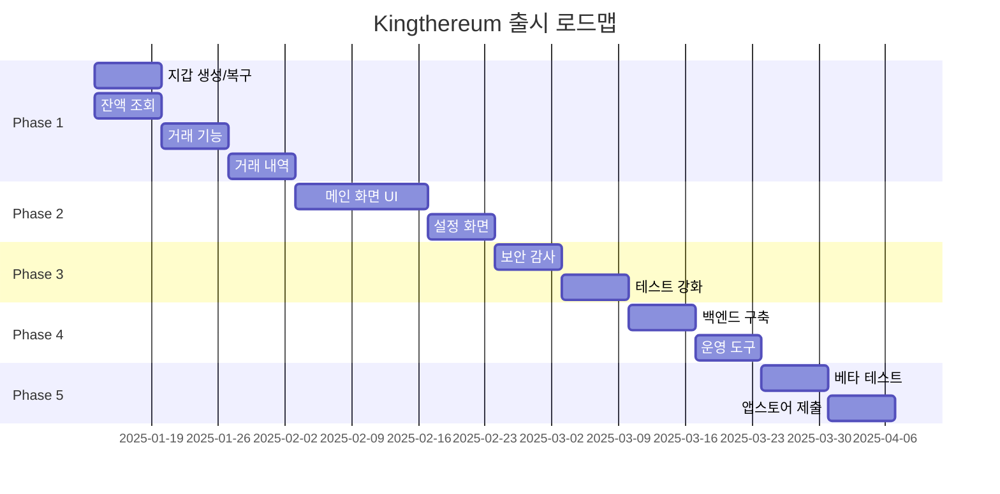

# 🚀 Kingthereum 출시 로드맵 - 완전한 실행 계획

## 📊 현재 상황 분석

### ✅ 잘 되어있는 부분
- **아키텍처**: Clean Architecture + VIP 패턴 구축 완료
- **보안 인프라**: PIN, 생체인증, 키체인 암호화 구현
- **모듈화**: Tuist 기반 6개 모듈 분리 완료
- **기술 스택**: Swift 6.0, iOS 18.0 최신 기술 적용

### ⚠️ 보완이 필요한 부분
- **핵심 기능 미완성**: 실제 사용 가능한 지갑 기능 부족
- **UI/UX 완성도**: 디자인은 있으나 실제 구현 미흡
- **테스트 부족**: 75% 커버리지로 프로덕션에는 부족
- **운영 인프라 부재**: 백엔드, 모니터링, 분석 도구 없음

---

## 🎯 Phase 1: MVP 핵심 기능 완성 (4주)

### Week 1-2: 지갑 핵심 기능 구현
#### 1. 지갑 생성 및 복구 플로우 완성
```
✅ 필수 구현 사항:
- [x] 니모닉 구문 생성 (BIP39)
- [x] 니모닉 백업 플로우 (스크린샷 방지)
- [x] 니모닉으로 지갑 복구
- [x] Private Key 가져오기
- [x] 다중 지갑 관리 (최소 3개)
```

#### 2. 잔액 조회 시스템
```
✅ 구현 내용:
- [ ] ETH 잔액 조회
- [ ] ERC-20 토큰 잔액 조회
- [ ] 토큰 목록 관리 (추가/삭제)
- [ ] 가격 정보 연동 (CoinGecko API)
- [ ] 포트폴리오 총 가치 계산
```

### Week 3: 거래 기능 구현
#### 1. Send (전송) 기능 완성
```
✅ VIP 패턴 적용:
- [ ] QR 코드 스캔으로 주소 입력
- [ ] 가스비 자동 계산 (Slow/Average/Fast)
- [ ] EIP-1559 지원 (maxFeePerGas, maxPriorityFeePerGas)
- [ ] 거래 서명 및 브로드캐스트
- [ ] 거래 상태 추적 (Pending → Success/Failed)
```

#### 2. Receive (수신) 기능
```
✅ 구현 내용:
- [ ] QR 코드 생성 (주소 + 금액)
- [ ] 주소 복사 기능
- [ ] 공유 기능 (Share Sheet)
```

### Week 4: 거래 내역 및 알림
#### 1. 거래 내역 관리
```
✅ 필수 기능:
- [ ] Etherscan API 연동
- [ ] 거래 내역 로컬 캐싱
- [ ] 거래 상세 정보 표시
- [ ] 거래 필터링 (날짜, 토큰, 상태)
- [ ] CSV 내보내기
```

#### 2. 푸시 알림
```
✅ 구현 사항:
- [ ] APNs 설정
- [ ] 거래 수신 알림
- [ ] 거래 완료 알림
- [ ] 가격 변동 알림 (옵션)
```

---

## 🎨 Phase 2: UI/UX 완성 (3주)

### Week 5-6: 핵심 화면 UI 구현
#### 1. 메인 화면 (Portfolio)
```
✅ UI 구현:
- [ ] 총 자산 카드 (글래스모피즘)
- [ ] 토큰 리스트 (SwiftUI List)
- [ ] 차트 통합 (Charts framework)
- [ ] Pull-to-refresh
- [ ] Skeleton loading
```

#### 2. 거래 화면
```
✅ UI 구현:
- [ ] Send 화면 (단계별 플로우)
- [ ] Receive 화면 (QR 코드 중심)
- [ ] 거래 확인 모달
- [ ] 거래 성공/실패 애니메이션
```

### Week 7: 설정 및 보조 화면
```
✅ 구현 화면:
- [ ] 설정 화면 (보안, 통화, 네트워크)
- [ ] 지갑 관리 화면
- [ ] 토큰 관리 화면
- [ ] 거래 내역 화면
- [ ] 온보딩 플로우 개선
```

---

## 🔒 Phase 3: 보안 강화 및 테스트 (2주)

### Week 8: 보안 감사
```
✅ 보안 검증:
- [ ] Private Key 메모리 관리 검증
- [ ] 네트워크 통신 암호화 확인
```

### Week 9: 테스트 강화
```
✅ 테스트 작성:
- [ ] Unit Test 커버리지 90% 달성
- [ ] Integration Test 작성
- [ ] UI Test 자동화 (주요 플로우)
- [ ] 성능 테스트 (메모리, CPU)
- [ ] 스트레스 테스트 (대량 거래)
```

---

## 🏗️ Phase 4: 인프라 구축 (2주)

### Week 10: 백엔드 서비스
```
✅ 구축 항목:
- [ ] Firebase 프로젝트 설정
- [ ] 푸시 알림 서버 (Firebase FCM)
- [ ] 가격 정보 캐싱 서버
- [ ] 거래 모니터링 서비스
- [ ] 사용자 설정 동기화 (CloudKit)
```

### Week 11: 운영 도구
```
✅ 설정 항목:
- [ ] Crashlytics 통합
- [ ] Analytics 설정 (Firebase/Mixpanel)
- [ ] A/B 테스트 프레임워크
- [ ] Remote Config 설정
- [ ] CI/CD 파이프라인 (GitHub Actions)
```

---

## 🚢 Phase 5: 출시 준비 (2주)

### Week 12: 베타 테스트
```
✅ TestFlight 준비:
- [ ] TestFlight 빌드 업로드
- [ ] 베타 테스터 모집 (50-100명)
- [ ] 피드백 수집 프로세스
- [ ] 버그 수정 및 개선
- [ ] 성능 최적화
```

### Week 13: 앱스토어 제출
```
✅ 제출 준비:
- [ ] App Store Connect 설정
- [ ] 앱 설명 작성 (한국어/영어)
- [ ] 스크린샷 준비 (모든 디바이스)
- [ ] 프로모션 비디오 제작
- [ ] 심사 노트 작성
- [ ] 개인정보 처리방침 작성
- [ ] 이용약관 작성
```

---

## 📋 추가 고려사항

### 법적/규제 준수
```
⚠️ 필수 확인 사항:
- [ ] 금융 관련 법규 검토
- [ ] 데이터 보호 규정 준수 (GDPR, KISA)
- [ ] 암호화폐 관련 규제 확인
- [ ] 면책 조항 작성
```

### 마케팅 준비
```
📢 준비 항목:
- [ ] 랜딩 페이지 제작
- [ ] 소셜 미디어 계정 생성
- [ ] 프레스킷 준비
- [ ] 커뮤니티 채널 개설 (Discord/Telegram)
- [ ] 초기 사용자 획득 전략
```

### 수익 모델 (선택사항)
```
💰 검토 사항:
- [ ] 거래 수수료 모델
- [ ] 프리미엄 기능 (Pro 버전)
- [ ] 토큰 스왑 수수료
- [ ] 파트너십 수익
```

---

## 📅 전체 타임라인



---

## 🎯 성공 지표 (KPIs)

### 출시 전
- ✅ 크래시 프리율 99.5% 이상
- ✅ 앱 크기 50MB 이하
- ✅ 콜드 스타트 2초 이내
- ✅ 테스트 커버리지 85% 이상

### 출시 후 (첫 3개월)
- 📊 DAU 1,000명 달성
- 📊 월간 거래량 $100K 달성
- 📊 앱스토어 평점 4.5 이상
- 📊 크래시율 0.5% 이하
- 📊 사용자 리텐션 30% (30일 기준)

---

## 🚨 리스크 관리

### 기술적 리스크
| 리스크 | 영향도 | 대응 방안 |
|--------|--------|----------|
| Web3 라이브러리 버그 | 높음 | 철저한 테스트, 대안 라이브러리 준비 |
| 네트워크 불안정 | 중간 | 재시도 로직, 오프라인 모드 |
| 키 관리 실수 | 매우 높음 | 다중 백업, 복구 프로세스 |

### 비즈니스 리스크
| 리스크 | 영향도 | 대응 방안 |
|--------|--------|----------|
| 앱스토어 리젝 | 높음 | 가이드라인 철저 준수, 사전 검토 |
| 경쟁 앱 출시 | 중간 | 차별화 기능 강화, 빠른 업데이트 |
| 규제 변경 | 높음 | 법률 자문, 유연한 아키텍처 |

---

## 💡 핵심 성공 요소

1. **보안 최우선**: 단 한 번의 보안 사고도 치명적
2. **사용자 경험**: 복잡한 블록체인을 쉽게 만들기
3. **신뢰성**: 100% 거래 성공률 보장
4. **성능**: 빠른 반응속도와 부드러운 애니메이션
5. **지속적 개선**: 사용자 피드백 빠른 반영

---

## 📝 체크리스트 요약

### 🔴 즉시 시작해야 할 작업 (Week 1)
- [ ] 니모닉 생성/복구 구현
- [ ] ETH 잔액 조회 구현
- [ ] Firebase 프로젝트 생성
- [ ] TestFlight 준비

### 🟡 중요하지만 긴급하지 않은 작업
- [ ] 마케팅 전략 수립
- [ ] 법률 검토
- [ ] 파트너십 논의

### 🟢 출시 후 개선사항
- [ ] DeFi 기능 추가
- [ ] NFT 지원
- [ ] 다중 체인 지원
- [ ] 하드웨어 지갑 연동

---

## 🏁 결론

현재 Kingthereum은 **훌륭한 기술적 기반**을 갖추고 있지만, **실제 사용 가능한 제품**으로 만들기 위해서는 약 **13주(3개월)의 집중적인 개발**이 필요합니다.

**우선순위:**
1. **핵심 지갑 기능** 완성 (생성, 복구, 전송, 수신)
2. **UI/UX** 완성도 향상
3. **보안 및 테스트** 강화
4. **운영 인프라** 구축
5. **출시 준비**

이 로드맵을 따라 체계적으로 진행한다면, **2025년 4월 초**에는 앱스토어에 출시 가능한 수준의 제품을 만들 수 있을 것입니다.
