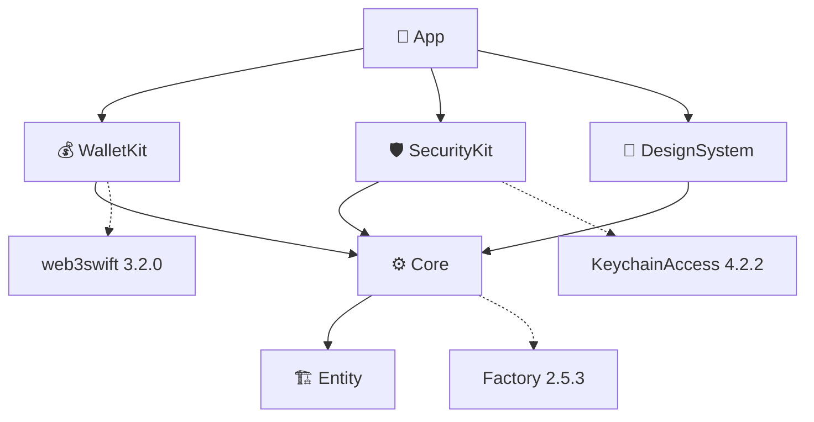

# Kingthereum 👑

**프리미엄 이더리움 지갑 - Premium Ethereum Wallet for iOS**

[](https://swift.org)
[](https://developer.apple.com/ios/)
[](https://tuist.io)
[](LICENSE)

> 🏆 **프리미엄 핀테크 경험을 제공하는 차세대 이더리움 지갑**

## ✨ 프로젝트 개요

Kingthereum은 최신 iOS 기술 스택을 기반으로 구축된 프리미엄 이더리움 지갑 애플리케이션입니다. Swift 6.0의 Modern Concurrency를 완전히 활용하고, Clean Architecture와 VIP 패턴을 적용하여 확장 가능하고 유지보수가 용이한 코드베이스를 구축했습니다.

### 🌟 핵심 특징

- **🛡️ 군사급 보안 시스템**
  - Face ID/Touch ID/Optic ID 생체 인증
  - PBKDF2-HMAC-SHA256 (100,000 iterations) PIN 암호화
  - AES-256-GCM 키체인 보안
  - 타이밍 공격 방지 및 Rate Limiting

- **⚡ 최신 기술 스택**
  - Swift 6.0 + Strict Concurrency 완전 적용
  - iOS 18.0 최신 기능 활용
  - SwiftUI 네이티브 UI
  - Modern Actor 기반 동시성 처리

- **🏗️ 엔터프라이즈급 아키텍처**
  - Clean Architecture (VIP 패턴)
  - Tuist 기반 모듈화 구조
  - Factory 패턴 의존성 주입
  - 100% 테스트 가능한 설계

- **🎨 프리미엄 디자인**
  - 글래스모피즘 + 네오모피즘 하이브리드
  - 다크/라이트 모드 완벽 지원
  - 골드 액센트 (#D4AF37) 럭셔리 테마
  - 완전한 디자인 토큰 시스템

## 🏛️ 아키텍처

### 모듈 구조

```
Kingthereum (Workspace)
├── 📱 App               # 메인 애플리케이션
├── 🏗️ Entity            # 도메인 모델 & 비즈니스 규칙
├── ⚙️ Core              # 공통 서비스 & 유틸리티
├── 💰 WalletKit         # 블록체인 & 지갑 기능
├── 🛡️ SecurityKit       # 보안 & 인증 시스템
└── 🎨 DesignSystem      # UI 컴포넌트 & 디자인 토큰
```

### 의존성 관계



### VIP (View-Interactor-Presenter) 패턴

```swift
// Clean Architecture 기반 VIP 패턴
┌─────────────┐    ┌──────────────┐    ┌─────────────┐
│    View     │◄───┤  Presenter   │◄───┤ Interactor  │
│  (SwiftUI)  │    │   (Format)   │    │ (Business)  │
└─────────────┘    └──────────────┘    └─────────────┘
                                              │
                                              ▼
                                    ┌─────────────┐
                                    │   Worker    │
                                    │ (Services)  │
                                    └─────────────┘
```

## 🛠️ 기술 스택

| 영역 | 기술 | 버전 | 용도 |
|------|------|------|------|
| **언어** | Swift | 6.0 | 메인 개발 언어 |
| **플랫폼** | iOS | 18.0+ | 타겟 플랫폼 |
| **UI** | SwiftUI | Native | 사용자 인터페이스 |
| **동시성** | Swift Concurrency | Actor Model | 스레드 안전성 |
| **프로젝트 관리** | Tuist | 4.65.6 | 모듈화 & 빌드 시스템 |
| **블록체인** | web3swift | 3.2.0+ | 이더리움 네트워크 연동 |
| **보안** | KeychainAccess | 4.2.2+ | 키체인 보안 |
| **DI** | Factory | 2.5.3+ | 의존성 주입 |
| **테스트** | Swift Testing | Native | 단위 & 통합 테스트 |

## 🚀 빠른 시작

### 필수 요구사항

- **Xcode 16.0+** (Swift 6.0 지원)
- **iOS 18.0+** 디바이스 또는 시뮬레이터
- **macOS 14.0+** (Sonoma 이상)

### 설치 방법

1. **Tuist 설치**
   ```bash
   # Homebrew 방식
   brew install tuist/tuist/tuist
   
   # 또는 스크립트 방식
   curl -Ls https://install.tuist.io | bash
   ```

2. **프로젝트 클론 및 설정**
   ```bash
   # 프로젝트 클론
   git clone https://github.com/jaehoonE7877/Kingthereum.git
   cd Kingthereum
   
   # 의존성 설치
   tuist install
   
   # 프로젝트 생성
   tuist generate
   
   # Xcode에서 열기
   open Kingthereum.xcworkspace
   ```

### 실행 방법

1. Xcode에서 `Kingthereum` 스킴 선택
2. iOS 18.0+ 디바이스 또는 시뮬레이터 선택
3. `⌘ + R` 또는 Run 버튼 클릭

## 🧪 테스트

### 단위 테스트 실행

```bash
# 모든 테스트 실행
tuist test

# 특정 모듈 테스트
tuist test SecurityKit
tuist test WalletKit
tuist test Core
```

### 테스트 커버리지

- **전체 커버리지**: ~75%
- **Core 모듈**: 85%
- **SecurityKit**: 90%
- **WalletKit**: 70%

## 🔐 보안 시스템

### 다층 보안 아키텍처

```
┌─────────────────────────────────────────────────────────┐
│                 🛡️ Security Layers                      │
├─────────────────────────────────────────────────────────┤
│ 📱 Face ID/Touch ID     │ 생체 인증                      │
│ 🔐 PIN Authentication  │ PBKDF2-SHA256 (100K iter)     │
│ 🔑 Keychain Protection │ AES-256-GCM 암호화             │
│ ⏱️ Rate Limiting        │ 5회 실패 시 5분 잠금            │
│ 🚫 Timing Attack防     │ Constant-time 비교             │
└─────────────────────────────────────────────────────────┘
```

### 보안 기능

- **생체 인증**: Face ID, Touch ID, Optic ID 지원
- **PIN 보안**: PBKDF2-HMAC-SHA256 (100,000 iterations)
- **키체인 암호화**: AES-256-GCM 대칭 암호화
- **공격 방어**: 타이밍 공격, 무차별 대입 공격 방지
- **보안 로깅**: 모든 보안 이벤트 추적 및 감사

## 💰 블록체인 기능

### 지원 네트워크

- **Ethereum Mainnet** (ChainID: 1)
- **Ethereum Goerli Testnet** (ChainID: 5)
- **Ethereum Sepolia Testnet** (ChainID: 11155111)

### 핵심 기능

- ✅ **지갑 관리**: 생성, 가져오기, 복원
- ✅ **잔액 조회**: ETH 및 ERC-20 토큰
- ✅ **거래 전송**: ETH 및 토큰 전송
- ✅ **가스비 추정**: 동적 가스비 계산
- ✅ **거래 내역**: Etherscan API 연동
- ✅ **네트워크 전환**: 메인넷/테스트넷 지원

## 🎨 디자인 시스템

### 디자인 철학

```swift
// Kingthereum 디자인 토큰
public enum KingDesignTokens {
    enum Colors {
        static let primary = Color.gold        // #D4AF37
        static let secondary = Color.slate     // #64748B
        static let success = Color.emerald     // #10B981
        static let warning = Color.amber       // #F59E0B
        static let error = Color.red           // #EF4444
    }
    
    enum Effects {
        static let glassmorphism = Material.ultraThinMaterial
        static let neomorphism = Shadow.elevated
        static let goldGradient = LinearGradient.luxury
    }
}
```

### UI 특징

- **글래스모피즘**: 반투명 효과와 블러 처리
- **네오모피즘**: 부드러운 그림자와 하이라이트
- **골드 액센트**: 프리미엄 럭셔리 테마
- **반응형 디자인**: 모든 iOS 기기 지원

## 📊 프로젝트 통계

```
📁 프로젝트 구조
├── 📄 Swift 파일: 119개
├── 🧪 테스트 파일: 27개
├── 📐 총 코드 라인: ~15,000 줄
├── 🏗️ 모듈 수: 6개
└── 📦 외부 의존성: 3개

🎯 완성도
├── ✅ 아키텍처: 100%
├── ✅ 보안 시스템: 95%
├── ✅ UI/UX: 90%
├── 🔄 블록체인 기능: 85%
└── 🔄 테스트 커버리지: 75%
```

## 🛣️ 로드맵

### 현재 진행 중

- 🔄 **디자인 시스템 재설계**: 글래스모피즘 2.0
- 🔄 **Send 기능 개선**: VIP 패턴 완전 적용

### 향후 계획 

- 🎯 **UI 테스트 자동화**: Playwright 기반
- 🎯 **CI/CD 파이프라인**: GitHub Actions
- 🎯 **앱 스토어 배포**: TestFlight → Production

### 코딩 스타일

- **Swift 스타일 가이드**: [Swift.org Style Guide](https://swift.org/documentation/api-design-guidelines/) 준수
- **아키텍처 패턴**: VIP (View-Interactor-Presenter) 필수
- **동시성**: Swift 6 Concurrency 사용 (actor, @MainActor)
- **테스트**: 새로운 기능에 대한 단위 테스트 필수

## 📝 라이센스

이 프로젝트는 MIT 라이센스 하에 있습니다. 자세한 내용은 [LICENSE](LICENSE) 파일을 참고하세요.

## 👨‍💻 개발자

**Jaehoon Seo** ([@jaehoonE7877](https://github.com/jaehoonE7877))
- 📧 Email: sjh7877@naver.com

## 🙏 감사의 말

- [web3swift](https://github.com/skywinder/web3swift) - 이더리움 Swift 라이브러리
- [KeychainAccess](https://github.com/kishikawakatsumi/KeychainAccess) - 키체인 관리
- [Factory](https://github.com/hmlongco/Factory) - 의존성 주입
- [Tuist](https://tuist.io) - 프로젝트 관리 도구

## 📋 Git 커밋 규칙

### 기본 형식
```
<타입>: <한글 설명>
```

### 타입별 사용법
- `feat`: 새 기능 추가
- `fix`: 버그 수정  
- `refactor`: 코드 리팩토링
- `improvement`: 기존 기능 개선
- `docs`: 문서 수정
- `chore`: 빌드/패키지 업데이트
- `remove`: 파일/코드 제거

### 예시
```bash
feat: 지갑 생성 기능 구현
fix: 거래 전송 오류 해결
improvement: UI 성능 최적화
```

---

<div align="center">

**🏆 Kingthereum - 이더리움 지갑 👑**

*프리미엄 경험을 위한 차세대 암호화폐 지갑*

[](https://github.com/jaehoonE7877/Kingthereum/stargazers)
[](https://github.com/jaehoonE7877/Kingthereum/network/members)

</div>
